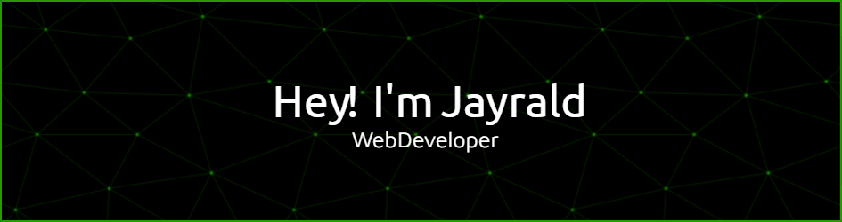

## Full-Stack Web Developer

Passionate about crafting efficient, scalable web applications with modern technologies. I bridge the gap between design and technical implementation to deliver seamless user experiences.

### 🚀 Core Technologies

  

### 📈 Development Activity

  
  

### 📫 Professional Connections

  
  
  

